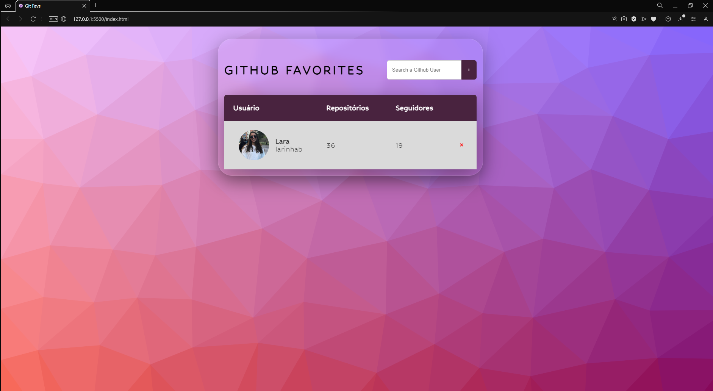
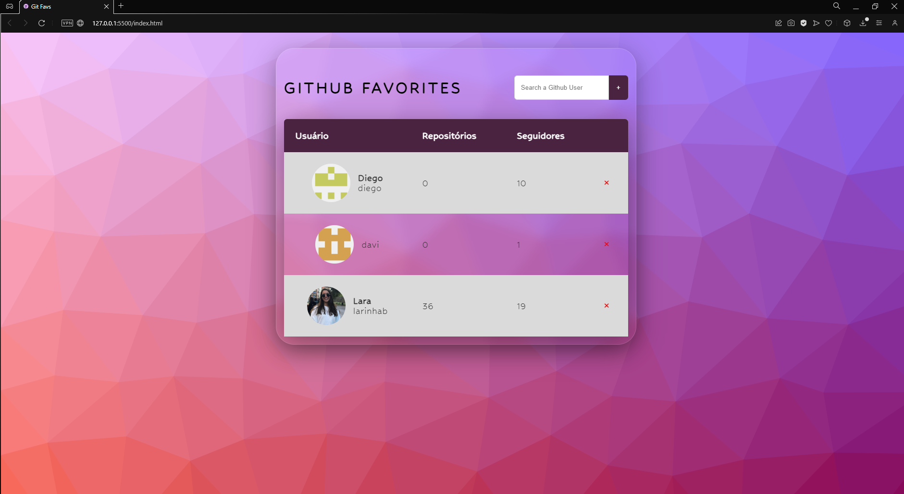
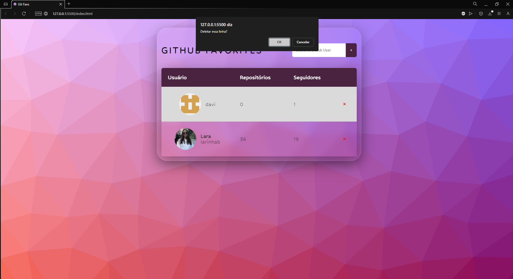
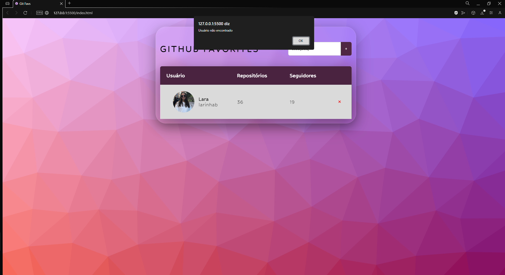

<h1 align="center">Github Favs</h1>

Github favorites profiles  

  <a href="#-tecnologias">Techs/Tecnologias</a>&nbsp;&nbsp;&nbsp;|&nbsp;&nbsp;&nbsp;
  <a href="#-projeto">Project/Projeto</a>&nbsp;&nbsp;&nbsp;|&nbsp;&nbsp;&nbsp;
  <a href="#-layout">Layout</a>&nbsp;&nbsp;&nbsp;|&nbsp;&nbsp;&nbsp;
  <a href="#memo-licença">License/Licença</a>

  

  

  

  

## 🚀 Techs / Tecnologias

Esse projeto foi desenvolvido com as seguintes tecnologias:

- HTML e CSS
- JavaScript
- Git e Github

## 💻 Project / Projeto

A aplicação consiste em primeiramente pesquisar um nome de usuário da plataforma Github que gostaria de adicionar, o nome pesquisado se estiver correto vai para uma tabela onde ficarão todos os perfis pesquisados pelo usuário. É possivel adicionar e remover perfis e cada perfil pesquisado mostra o seguintes resultados: nome do usuário, quantidade de repositórios e quantidade de seguidores. A aplicação não aceita nomes repetidos e não aceita nomes que não existam dentro do Github.

The application consists of first searching for a username on the Github platform that you would like to add, the searched name, if correct, goes to a table where all the profiles searched by the user will be located. It is possible to add and remove profiles and each searched profile shows the following results: user name, number of repositories and number of followers. The application does not accept repeated names and does not accept names that do not exist within Github.

## 🔖 Layout

Você pode visualizar o layout do projeto através do repositório. 
